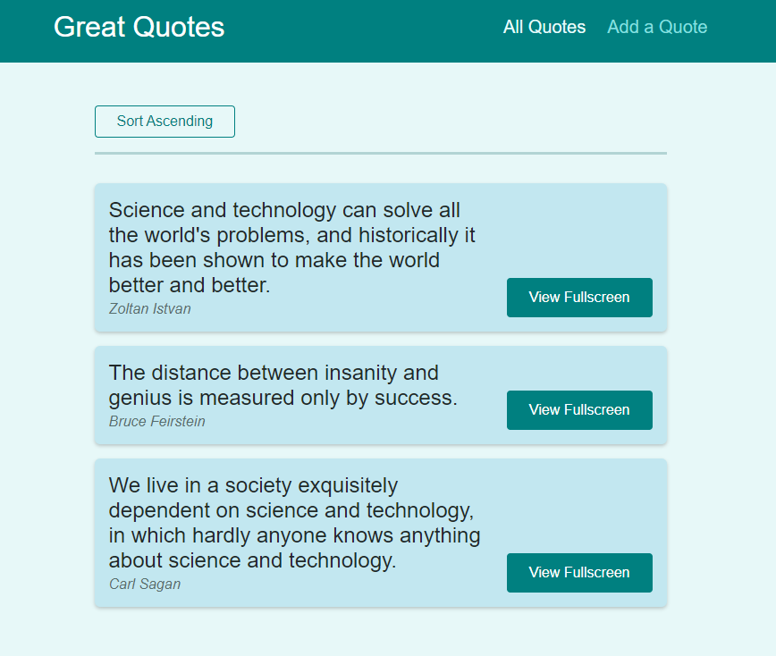

<br />
<p align="center">
  <h3 align="center">World Wide Quotes Webside</h3>

  <p align="center">
    A website you can go ready inspiring quotes!
    <br />
    <a href="https://quotes-bc37b.web.app/quotes">View Demo</a>
    ·
    <a href="https://github.com/nguyenxuongkim2103/react-route/issues">Report Bug</a>
    ·
    <a href="https://github.com/nguyenxuongkim2103/react-route/issues">Request Feature</a>
  </p>
</p>


<!-- TABLE OF CONTENTS -->
<details open="open">
  <summary>Table of Contents</summary>
  <ol>
    <li>
      <a href="#about-the-project">About The Project</a>
      <ul>
        <li><a href="#built-with">Built With</a></li>
      </ul>
    </li>
    <li>
      <a href="#getting-started">Getting Started</a>
      <ul>
        <li><a href="#prerequisites">Prerequisites</a></li>
        <li><a href="#installation">Installation</a></li>
      </ul>
    </li>
    <li><a href="#roadmap">Roadmap</a></li>
    <li><a href="#contributing">Contributing</a></li>
    <li><a href="#license">License</a></li>
    <li><a href="#contact">Contact</a></li>
  </ol>
</details>


<!-- ABOUT THE PROJECT -->
## About The Project
<p align="center">
  
</p>
This is just a dummy example website that I created to practice ReactJS.

### Built With


* [ReactJS](https://reactjs.org/)
* [Google Firebase](https://firebase.google.com/)


<!-- GETTING STARTED -->
## Getting Started

You need to install Node Package Manager first.

### Prerequisites


* npm
  ```sh
  npm install npm@latest -g
  ```

### Installation

1. Clone the repo
   ```sh
   git clone https://github.com/nguyenxuongkim2103/react-route.git
   ```
2. Install NPM packages
   ```sh
   npm install
   ```

<!-- ROADMAP -->
## Roadmap

See the [open issues](https://github.com/othneildrew/Best-README-Template/issues) for a list of proposed features (and known issues).


<!-- CONTRIBUTING -->
## Contributing

Contributions are what make the open source community such an amazing place to be learn, inspire, and create. Any contributions you make are **greatly appreciated**.

1. Fork the Project
2. Create your Feature Branch (`git checkout -b feature/AmazingFeature`)
3. Commit your Changes (`git commit -m 'Add some AmazingFeature'`)
4. Push to the Branch (`git push origin feature/AmazingFeature`)
5. Open a Pull Request


<!-- LICENSE -->
## License

Distributed under the MIT License. See `LICENSE` for more information.


<!-- CONTACT -->
## Contact

Twitter - [@nguyenxuongkim](https://twitter.com/nguyenxuongkim)
Linkedin - [Kim Nguyen](https://www.linkedin.com/in/kim-nguyen-xuong/)
